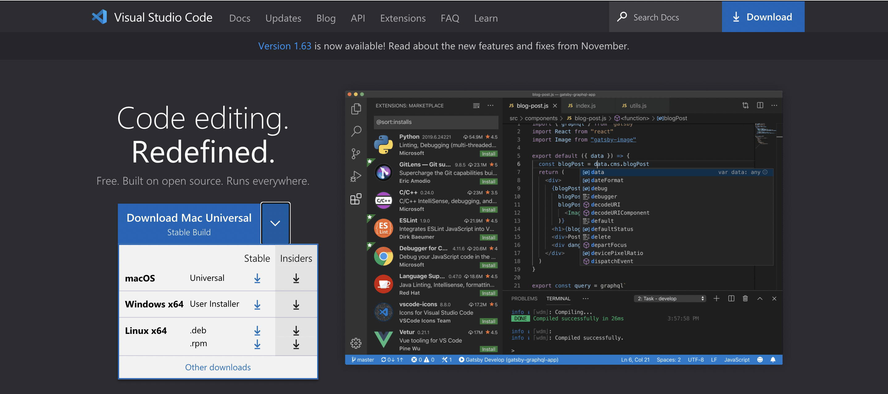
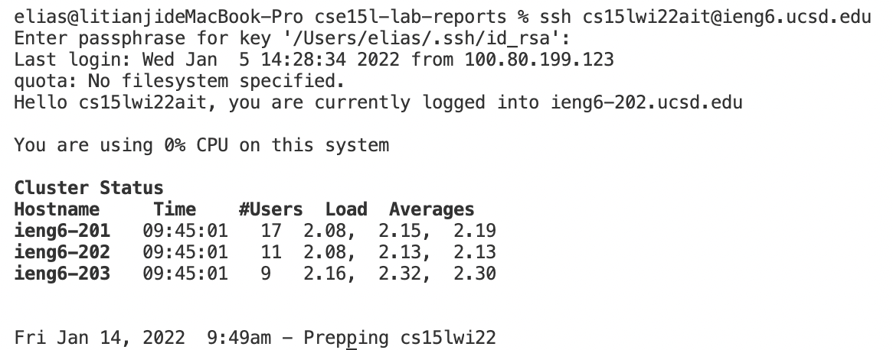
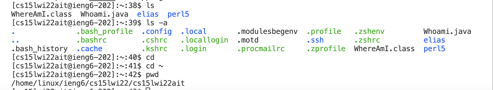
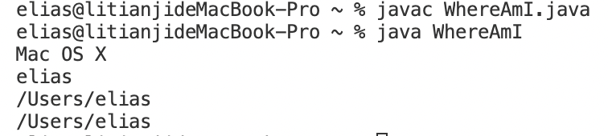
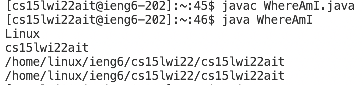
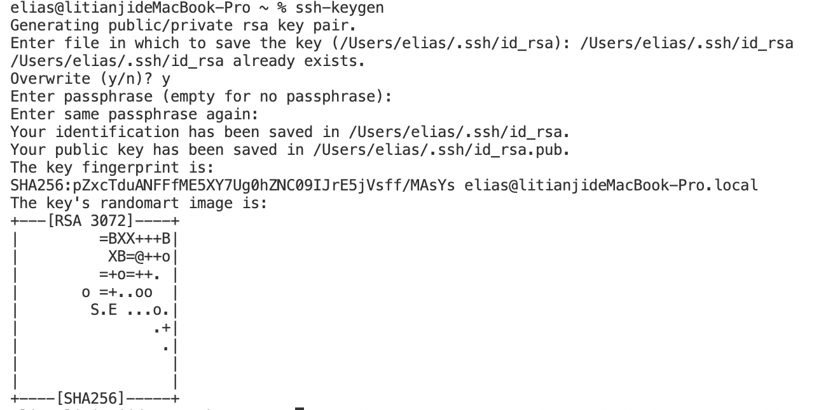
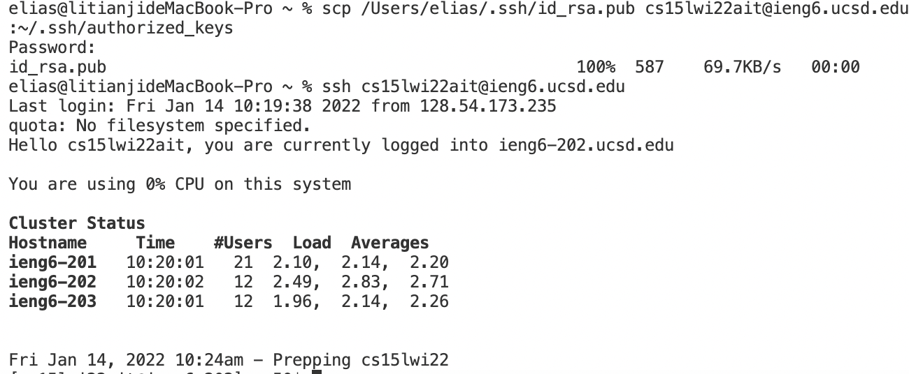
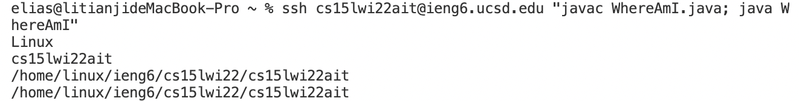

# Toturial for incoming cse15L students
## Step 1: Installing VScode
1. Open the [VScode Official Website](https://code.visualstudio.com/) on your computer, choose the correct version that correspond to your computer and download.

2. After successfully dowload and install the VScode, it should look like this

---
## Step 2: Remotely Connecting
1. Go to [https://sdacs.ucsd.edu/~icc/index.php](https://sdacs.ucsd.edu/~icc/index.php) to look up for your cse15L sepcific account. You should reset your password to active this account.(**Remember don't change all of your passwords!**)
2. Open a terminal in your VScode then type ```ssh cs15lwi22ait@ieng6.ucsd.edu``` in your terminal. *ait* here is specific to my account, you should change ```ait``` with your own username for cse15L.
3. If it is your first login, you may asked whether you want to keep connecting. Answer **yes** for the question. If you don't see the question, just regard this step.
4. Now your computer is successfully connected to the remote server and it should look like this.

## Step 3: Trying Some Commands
You search some commands on the internet and type it into your terminal.
Here's the commands I tried:

```ls```

```ls -a```

```cd```

```cd ~```

```pwd```

Here's the result:

## Step 4: Moving Files with scp
1. Create an example java file WhereAmI.java
The code should like this:
```
class WhereAmI {
  public static void main(String[] args) {
    System.out.println(System.getProperty("os.name"));
    System.out.println(System.getProperty("user.name"));
    System.out.println(System.getProperty("user.home"));
    System.out.println(System.getProperty("user.dir"));
  }
}
```
2. Use javac and java to compile and run the java file on your computer and see the outcome:

3. Type ```scp WhereAmI.java cs15lwi22ait@ieng6.ucsd.edu:~/``` in your terminal, then login into your server and run javac and java command on your server to see what's happening:

## Step 5: Setting an SSH Key
When setup the ssh key in order to make it easier to operate between the client and the server without using password.
1. type ```ssh-keygen``` in your terminal, enter the file to save it, and enter the passphrase you want, you can set the passprahse easier so that you can operate conveniently.

This created two new files on your system; the private key (in a file **id_rsa**) and the public key (in a file **id_rsa.pub**), stored in the .ssh directory on your computer.
2. Now you need to copy the public key to the .ssh directory of your user account on the server.

We can see that no password needed when trying to login in after seting a passphrase
## Step 6: Optimizing Remote Running
There are two ways that you can run your command more pleasantly
1. You can quote you want to run directly after the **ssh** command so that it can run directly on your server.
2. You can use semicolons to run multiple commands on the same line.

By combining these two tips, I can compile and run *WhereAmI.java* directly on server without login to it.

