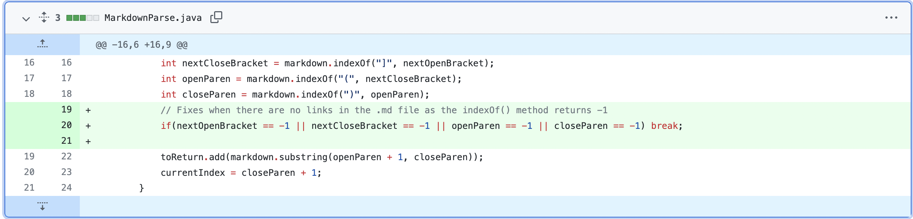
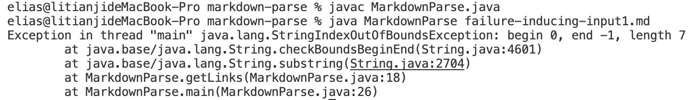
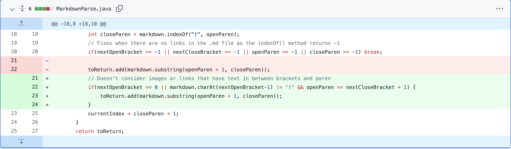
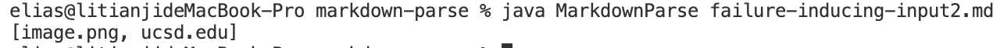
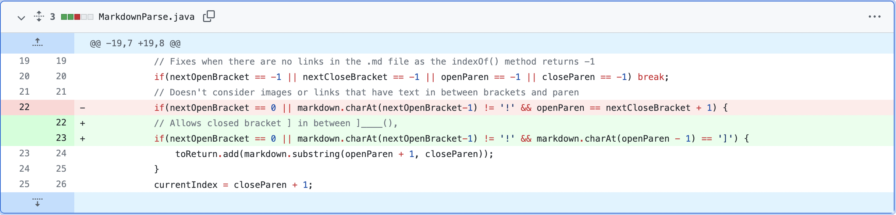
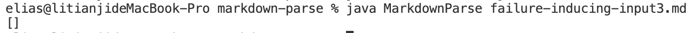

# MarkdownParseTest
## Code Change 1

Here's the test leading the change:[failure inducing input 1](https://github.com/til026/cse15l-lab-reports/edit/main/failure-inducing-input1.md)
Running the file outputs this:

## Code Change 2

Here's the test leading the change: [failure inducing input 2](https://github.com/til026/cse15l-lab-reports/edit/main/failure-inducing-input2.md)
Running the file outputs this:

## Code Change 3

Here's the test leading the change: [failure inducing input 3](https://github.com/til026/cse15l-lab-reports/edit/main/failure-inducing-input3.md)
Running the file outputs this:
