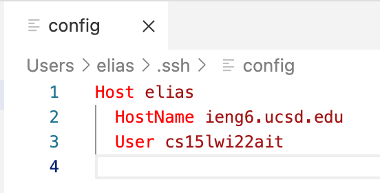
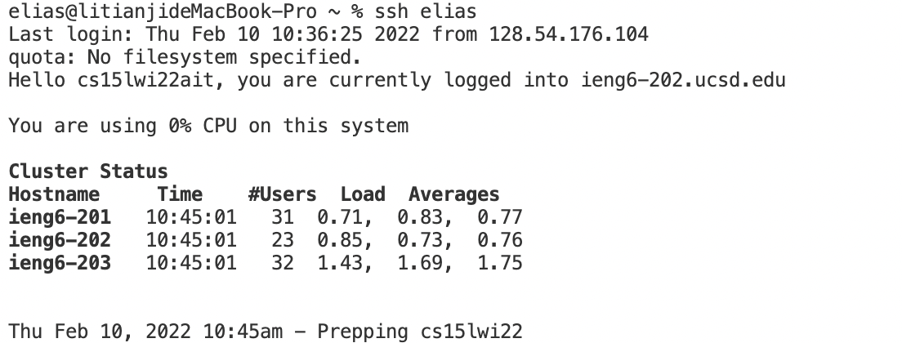

# Streamlining ssh Configuration
## Editing ```.ssh/config``` file through vscode

Change my alias' name to elias
## ```ssh``` command login with new alias name

succesfully login into the remote server
## ```scp``` command copy file with new alias name

successfully copy the file WhereAmI.java to remote server