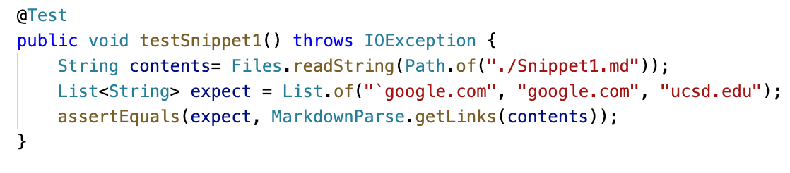
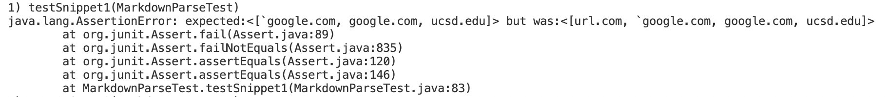
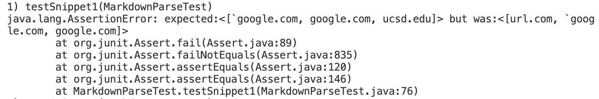
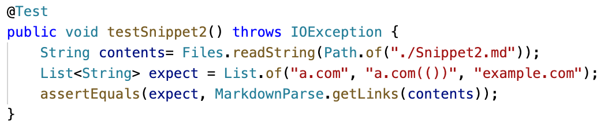
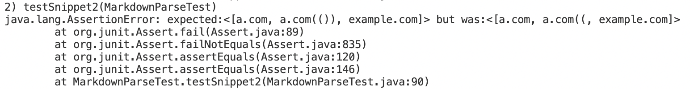
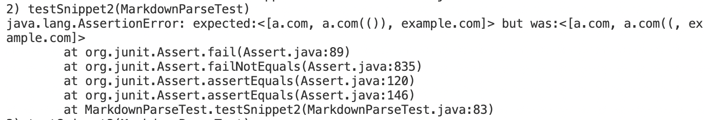
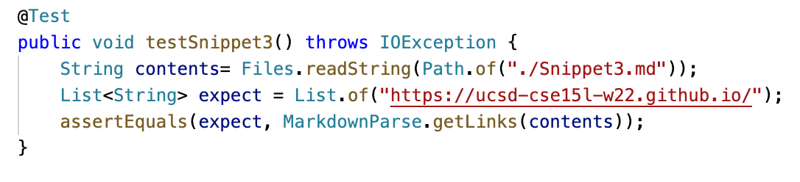
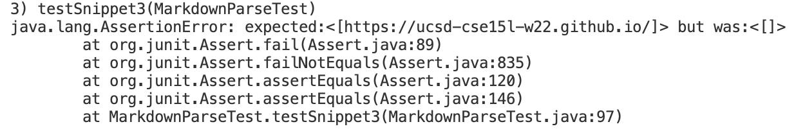
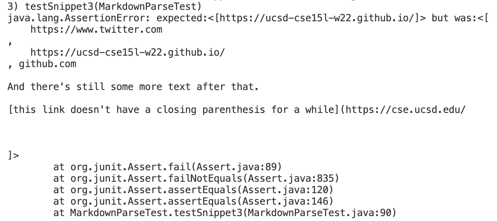

# Markdown Snippets
## Snippet 1
### The Expect Output
```
[`google.com, google.com, ucsd.edu]
```
### The Way I Turned It Into a Test
First I create a file `Snippet1.md`, copy and paste Snippet 1 into it.

Then I write a test method in `MarkdownParseTest` like this:

### Result of My Code

### Result of the Code I Reviewed


## Snippet 2
### The Expect Output
```
[a.com, a.com(()), example.com]
```
### The Way I Turned It Into a Test
First I create a file `Snippet2.md`, copy and paste Snippet 1 into it.

Then I write a test method in `MarkdownParseTest` like this:

### Result of My Code

### Result of the Code I Reviewed

## Snippet 3
### The Expect Output
```
[https://ucsd-cse15l-w22.github.io/]
```
### The Way I Turned It Into a Test
First I create a file `Snippet3.md`, copy and paste Snippet 1 into it.

Then I write a test method in `MarkdownParseTest` like this:

### Result of My Code

### Result of the Code I Reviewed


## Reflection on Revising
### Snippet 1
I think I can solve part of the related cases. 

The mechanism of Markdown related to grave accent is that if there is one grave accent in fornt of the close bracket, it won't be considered as a link unless there's no grave accent between open and close bracket or all the grave accents between open and close bracket are consecuive(no other characters between them). If there are more than one grave accents in front of the open bracket, it won't make influence no matter how many grave accents are between open and close bracket. 

The form of revising code is basicly like this:

1. check if there's only one grave accent in front of open bracket

2. if more than one, run the remaining part of program as usual

3. if only one, check the characters between open and close bracket

4. if no grave accent between two brackets or all the grave accents are consecutive(one possible solution is to write a while loop to first get the index of all the grave accents, then check if they are consecutive), it is a link, else, not a link, continue to next while loop.

However, the case will be much more complicated if nested brackets also appears. I think the nested problems can largely be solved with the proper use of a stack frame, but it would be complicated and much longer than 10 lines.

### Snippet 2
I don't think there's a trivial solution for this problem. 

The mechanism of parenthesis is if there are more open paren than close paren, it is not a link, once at a time close paren can be paired with all the open paren, the link stop. 

So the solution for this need a stack ADT. We can first push a open paren into the stack, once we meet a open paren, push another open paren into the stack, once we met a close paren, pop a open paren out of the stack. once the stack is empty, stop and the index we at is the index of the closeParen, output the link. if the stack is not empty until we hit the start of next link, skip this and trun into next while loop.

The solution will work, however, I think it will be more than 10 lines.

### Snippet 3
I think I can make the related cases passed. 

The reason I fail sippet 3 is because I'm checking for `/n` in the text.
In Markdown, if there's only one `/n` before or after, it is a link, however, if there are two consecutive new line, it is not a link. So instead of checking if the number of  `/n` is bigger than 1, I should check whether there exits two consecutive `/n` between openParen and closeParen. And that should solve the problem.