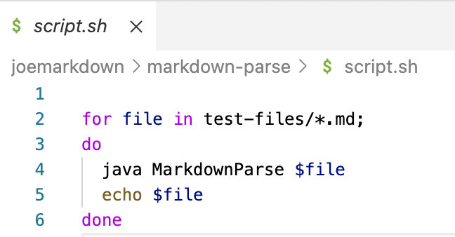
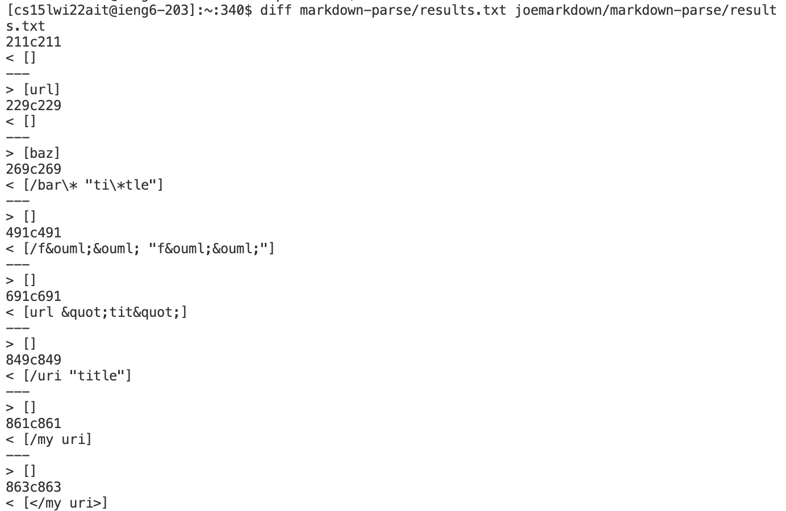
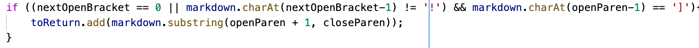
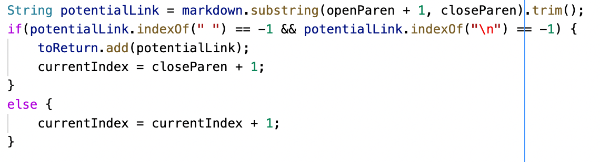

# Detecting and Analyzing Differences
## Way to Find Tests with Different Results
### 1. Write the code for .sh to run all the tests 

### 2. Storage the test results
`bash script.sh > results.txt`

here I store the results into a file called results.txt

(do these two steps for both Joe's MarkdownParse and mine MarkdownParse)
### 3. Use diff two compare the results using two results.txt
`diff markdown-parse/results.txt joemarkdown/markdown-parse/results.txt`
And it shows the different between two results.

## Sample Test 1
Test 567:
```
[foo](not a link)


[foo]: /url1
```
My output: `[not a link]`
Joe's output : `[]`
Expect output: `[]`

My implementation was wrong because my markdown doesn't consider spaces between the parenthesis. I should first use the method .trim and them check if there are any spaces between the openParen and closeParen.

Part of my code need to be changed:

## Sample Test 2
Test 577:
```

```
My output: `[]`
Joe's output : `[train.jpg]`
Expect output: `[]`

Joe's implementation was wrong because his markdown doesn't consider the difference between a link and an image through checking if there is a `!` before the link. He should use charAt to see if there is a `!` right before the open brasket.

Part of his code need to be changed:
